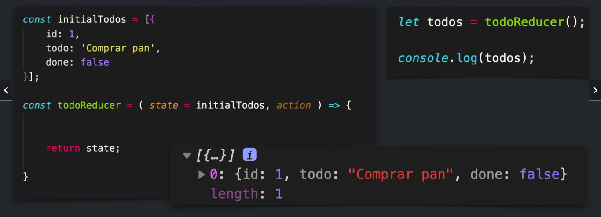

## Reducer

Funcion pura que recibe el estado inicial o anterior, y una accion que se encarga de producir un nuevo estado basado en la accion que recibio

https://es.reactjs.org/docs/hooks-reference.html#usereducer

