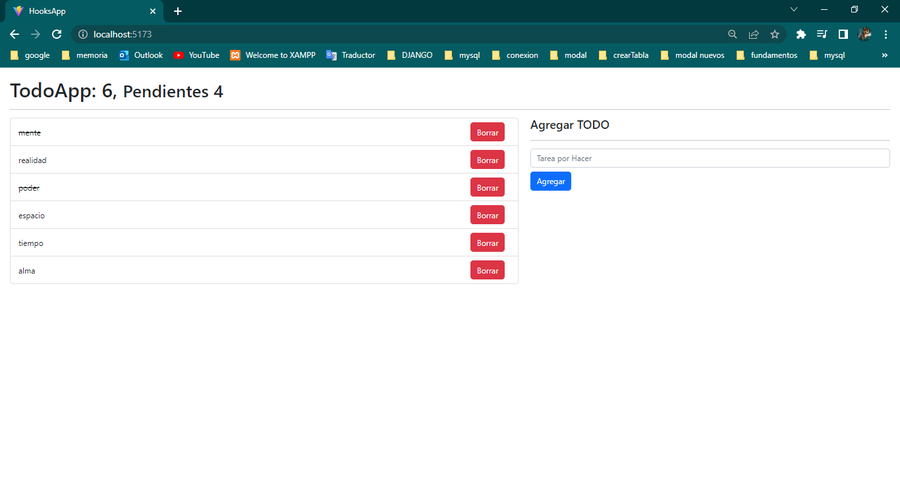
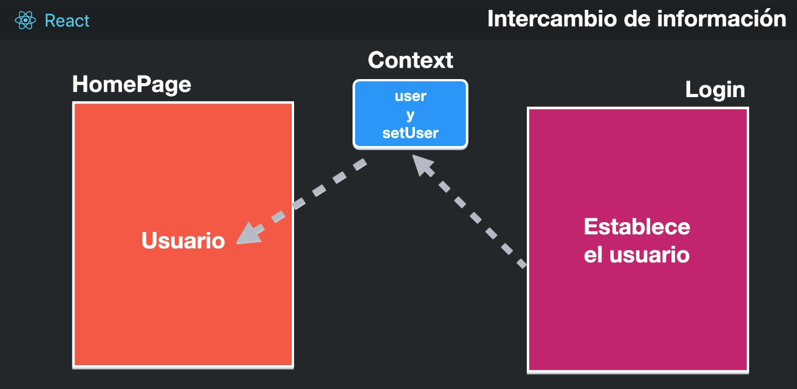

# TodoApp

## Reducer

Funcion pura que recibe el estado inicial o anterior, y una accion que se encarga de producir un nuevo estado basado en la accion que recibio

https://es.reactjs.org/docs/hooks-reference.html#usereducer

## Context

Funcion que se encarga de crear un espacio para obtener informacion esto entre componentes

Nota

la palabra class no debe utilizarse en un .jsx react interpreta que se trata de una clase, en su lugar debe colocarse className para una clase de css segun sea el caso
